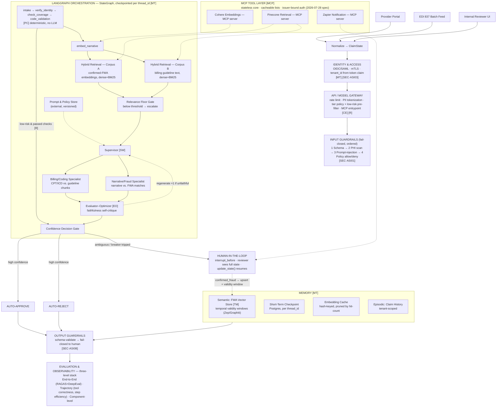

# Healthcare Claims Authentication Platform — Final Architecture

*Reference architecture v2 (final) — a single end-to-end map of every feature this project has accumulated across three design passes: the original LangGraph POC, the production-hardening additions (gateway, tenancy, memory), and the 2026 agentic-AI patterns pass (context engineering, multi-agent, MCP, temporal memory, trajectory evals, OWASP). Every box below is a real node in the graph, not an aspirational label.*

**Tags:** LangGraph StateGraph · Hybrid RAG · Supervisor–Worker · Human-in-the-Loop · Multi-tenant/HIPAA · MCP tool layer · 3-level evaluation

---

## Pattern Legend

| Tag | Pattern | What it means |
|---|---|---|
| **PC** | Prompt Chaining | Sequential stages, each consuming the last stage's output |
| **R** | Routing | Classify, then send down a specialized path |
| **FO** | Fan-out / Parallelization | Independent sub-tasks run at once, merged after |
| **SW** | Supervisor–Worker | Coordinator delegates to narrow specialist sub-agents |
| **EO** | Evaluator–Optimizer | A second pass critiques the first before it's trusted |
| **CE** | Context Engineering | Deliberate token budget: instructions / retrieval / memory / tools |
| **TM** | Temporal Memory | Facts carry a validity window, not just a similarity score |
| **MCP** | MCP Tool Layer | Tools exposed as standardized, swappable protocol servers |
| **SEC** | OWASP Agentic Mitigation | Addresses a named risk from the 2026 Top 10 for Agentic Apps |
| **MT** | Multi-Tenancy | `tenant_id` threaded from token claim to every store |

---

## Architecture Flow

> Every claim's full path: three intake channels normalize into one `ClaimState`, pass through identity, the gateway's tier/pre-filter policy, and ordered input guardrails, then enter the LangGraph core — deterministic checks, a low-risk bypass, parallel hybrid retrieval against two corpora, a supervisor delegating to two specialist sub-agents, an evaluator-optimizer faithfulness check, and a three-way confidence gate. Escalations pause for a human and feed confirmed fraud back into temporal long-term memory; every path reconverges at output guardrails and a three-level evaluation stack — all bounded by a PHI tokenization perimeter (every store and call operates on tokens only) and MCP-standardized tool calls.

---

## 1. Channels & Ingestion

Claims enter through one of three channels — a provider self-service portal, a batch EDI 837 feed, or an internal reviewer UI for manually keyed claims. All three normalize into the same intake contract before anything else happens: 14+ structured fields (patient identifier, provider identifier, CPT/ICD codes, claim amount, service dates, free-text narrative) initialized into the shared `ClaimState`.

Enrichment (provider specialty, reimbursement rate) is fetched conditionally, only when a downstream node needs it — a deliberate context-engineering choice, not an oversight. Keeping this parse step thin and channel-specific is what lets a fourth channel be added later without touching the orchestration graph at all.

## 2. Identity, Access & Multi-Tenancy `SEC·ASI03` `MT`

Every request carries an OIDC token; the gateway validates it and resolves `tenant_id` from the token's claims — never from the request body, which is user-controllable and therefore not a trust boundary. Service-to-service calls use mutual TLS with short-lived certificates instead of static API keys.

Multi-tenancy is enforced through four decisions, threaded from this point forward:
- **tenant_id in state** — every node reads it before touching data
- **separate retrieval indexes per tenant** — not one shared index with a metadata filter; physically unreachable beats merely filtered-out for a HIPAA audit
- **isolated LLM context** — never batching claims across tenants into one call
- **partitioned observability** — every trace tagged at instrumentation time

> **Why this is a trust boundary, not a config flag:** one node forgetting to filter by `tenant_id` is a HIPAA violation, which is exactly why it lives in shared state rather than being re-derived per node.

## 3. API / Model Gateway `CE` `R`

The single choke point every claim passes through exactly once. It centralizes what would otherwise be duplicated across every node:

- **rate limiting** — token-bucket, per tenant
- **PII/PHI tokenization** — structured identifiers become reversible tokens before anything downstream sees them
- **model-tier policy engine + low-risk pre-filter** — claims passing every rule-based check below a billed-amount threshold skip the LLM entirely
- **fallback chain** across model providers/tiers on error or timeout
- **audit envelope** — a `trace_id` threading through every downstream span

This is also where context engineering starts in earnest: the gateway decides, before a single token of retrieval or reasoning is spent, how much of the pipeline a given claim actually needs to touch.

## 4. Input Guardrails `SEC·ASI01`

Guardrails run strictly before any external call and fail closed — a violation is a hard stop to human review, not a logged warning. Fixed order, each cheap enough to run on every claim:

1. **Schema validation**
2. **PHI-in-free-text detection** — catches identifiers typed into a notes field, which field-based tokenization can't see
3. **Prompt-injection / instruction-override detection** on the narrative before it's embedded or sent anywhere — a caught attempt means embedding and LLM nodes never execute for that claim
4. **Policy allow/deny** — claim types, provider IDs, or amounts outside the operating envelope are force-routed to human review regardless of what any model would conclude

## 5. Orchestration Core — The Hospital-Triage Model `PC`

A single LLM call can't pause, check something, loop back on failure, or hand off — exactly the gap LangGraph closes. Think of an ER: a receptionist checks a patient in, triage assesses severity, critical cases go straight to the trauma team, the doctor examines and orders tests, results come back and a decision is made. Every staff member knows the patient's state; the file travels with them; a failed test has a defined escalation path. LangGraph is that workflow for an agent: **shared state** is the patient file, **nodes** are staff, **conditional edges** are triage decisions.

The deterministic chain — `intake → verify_identity → check_coverage → code_validation` — runs with no LLM involvement at all: cheap, auditable, unambiguous. A claim passing every check below the billed-amount threshold takes the pre-filter branch straight to auto-approval, never touching retrieval or reasoning.

## 6. Hybrid RAG — The Open-Book-Exam Model `FO` `CE`

An LLM reasoning from memory alone has two disqualifying problems here: its knowledge is frozen at training cutoff, and unconfident guesses can look like confident reasoning. RAG makes it an open-book student — it supplies reasoning, the vector database supplies current knowledge, and retrieval runs against two corpora kept deliberately separate:

- **Corpus A** — confirmed-FWA case embeddings (a high match here is a bad sign)
- **Corpus B** — current billing-guideline text (a high match here grounds the reasoning in actual policy language)

**Chunking** is structure-aware — split on numbered-rule boundaries, overlap only for oversized rules — and every chunk carries `effective_date` so retrieval reflects the guideline version actually in force on the claim's service date.

**Retrieval runs three ways**: pure dense misses exact code matches (a CPT number, "myocardial infarction" vs. "heart attack" the other way); pure keyword (BM25) misses paraphrase; hybrid — both in parallel, fused via weighted min-max sum and Reciprocal Rank Fusion — is the only approach that reliably handles narratives mixing free clinical text with precise codes. A **relevance floor gate** checks the top dense score before anything reaches the LLM: below it, escalate rather than let the model reason over a weak match.

## 7. Prompt & Policy Versioning

Prompts and the gateway's tier policy are the platform's policy layer — they change on a "we found a failure mode" or "the guideline updated this quarter" cadence, which is faster than any release train should have to accommodate. An external, versioned store (name, version, text, author, change reason) is loaded by name at runtime instead of compiled into the script; a change ships as a database write, A/B testing routes a percentage of traffic to a new version, and every trace records which version was active — so a faithfulness-score movement is always attributable to a specific edit, never unexplained drift.

## 8. Multi-Agent Reasoning — Supervisor–Worker `SW`

Rather than one LLM call doing everything, a **Supervisor** delegates to two narrow specialist sub-agents and synthesizes their outputs into the structure the downstream gate expects (`anomaly_type`, `confidence`, reasoning, `recommended_action`):

- **Billing/Coding Specialist** — checks CPT/ICD plausibility against retrieved guideline chunks
- **Narrative/Fraud Specialist** — checks the free-text narrative against FWA case matches

Each specialist retrieves against its own narrow scope and reports a summary upward — sub-agent isolation, so context never bloats with a field the other specialist doesn't need.

2026 industry consensus names this the *supervisor (hierarchical delegation)* pattern and calls it "the production default" for exactly this reason: it lets each specialist's prompt, retrieval scope, and even model tier be tuned independently, without touching the other's logic or the downstream gate at all.

## 9. Evaluator–Optimizer — Faithfulness Self-Critique `EO`

A second, cheap-tier LLM call checks the Supervisor's synthesized reasoning against what was actually retrieved: does it cite only the retrieved chunks, or does it drift beyond them into plausible-sounding but ungrounded reasoning? On a failure, it can force one regeneration before the claim proceeds — a second safety net that complements the output guardrails, which check *format*, not *faithfulness*.

This is the evaluator-optimizer pattern: one LLM generates, a second provides iterative feedback, applied here in the specific place it earns its cost — the exact step where a hallucinated citation would otherwise slip through unnoticed.

## 10. Confidence Decision Gate & Circuit Breaker `SEC·ASI08`

The gate reads `confidence` and `recommended_action` together, not either alone — "reject, low confidence" and "reject, high confidence" are treated differently. High confidence with a clear recommendation auto-approves or auto-rejects; the ambiguous middle, a validation failure, or a tripped circuit breaker escalates.

The **circuit breaker** is deliberately separate from guardrails: it tracks *tool reliability* (Pinecone/Cohere availability), while guardrails track *content validity* — a down dependency is never mistaken for a security event, and a prompt-injection attempt is never treated as a retryable blip. Retrieval nodes retry to a threshold, then trip the breaker and escalate without ever reaching the LLM. This shifts the failure mode from *silent wrong answer* to *explicit escalation* — in healthcare, a patient-safety requirement, not a reliability preference.

## 11. Human-in-the-Loop & the Feedback Loop

`interrupt_before` pauses the graph immediately before routing whenever the gate, breaker, or a guardrail escalates — a real suspension of execution, checkpointed like everything else. The SIU reviewer sees the entire accumulated state: identity and coverage results, the specific retrieved chunks, the fraud-similarity match and score, and both specialists' reasoning plus the evaluator's critique. `update_state()` resumes exactly where it paused.

Every escalation the reviewer confirms as fraud feeds back into long-term memory — closing the loop between human judgment and every future claim's retrieval. Auto-approve and auto-reject only ever fire above defined confidence thresholds; the accountability mechanism is architectural, not a policy statement layered on top.

## 12. Memory Architecture `TM` `MT`

**Short-term (thread state):** the `ClaimState` for one claim's run, checkpointed after every node, keyed by `thread_id` — narrow job: resume after a transient failure without re-executing completed nodes.

**Long-term, episodic:** a relational claim-history table, tenant-scoped and keyed by tokenized identifiers, for cross-claim frequency lookups.

**Long-term, semantic:** the append-only FWA vector namespace, growing only from confirmed reviewer decisions.

**The temporal upgrade:** a plain vector store can't reason about time — a confirmed-fraud pattern from two years ago under an old coding scheme shouldn't carry the same retrieval weight as one from last month. Structuring this store as a temporal knowledge graph (the Zep/Graphiti pattern — facts carry validity windows: when something was true, when it was superseded) fits this platform's own quarterly-guideline-update reality better than similarity score alone.

**The embedding cache** is architecturally distinct from both: it exists purely to avoid redundant compute (hash-keyed on narrative text, pruned by hit-count) and holds no decision-relevant history, whereas long-term memory exists specifically to inform future decisions.

## 13. MCP Tool Layer `MCP`

Cohere, Pinecone, and Zapier are exposed as standardized MCP servers rather than hardcoded SDK calls inside graph nodes — the difference between an agent with fixed tool integrations and one with a swappable, standardized tool interface. The July 2026 spec update matters concretely here:

- **Stateless protocol core** — any request can land on any server instance behind a plain round-robin load balancer (no session affinity to manage under load)
- **List caching** (`ttlMs`, `cacheScope`) — stops the gateway from re-fetching tool/prompt lists every call
- **Long-running task support** graduated out of experimental status, fitting a retrieval or embedding call that occasionally runs long
- **Hardened auth** (RFC 9207 issuer validation, issuer-bound client credentials) — closes an authorization-server mix-up class of vulnerability that matters the moment sub-agents start calling tools on each other's behalf

## 14. Output Guardrails `SEC·ASI08`

The LLM's raw response is schema-validated before it's trusted — an unparseable or incomplete response fails closed to human review rather than being coerced into a best-effort decision. Both the approve/reject bypass paths and the human-resolved escalation path reconverge here, so nothing reaches a downstream system without passing this check regardless of which path produced it.

## 15. Evaluation — the Three-Level Stack

Standard logging says what happened; it doesn't say whether the reasoning was correct. Automated evaluation now runs at three levels, each catching a different failure class:

| Level | What it checks | Tools |
|---|---|---|
| **End-to-end** | Content quality | RAGAS (context precision, faithfulness, answer relevancy) + DeepEval bias slicing, weekly 5% sample |
| **Trajectory** | Did it take a good path | Tool Correctness (right tools, right params — deterministic), Step Efficiency (did the low-risk pre-filter actually get used) |
| **Component-level** | Where exactly it degraded | Isolates retrieval precision vs. reasoning faithfulness vs. gate calibration, rather than one blended score |

A concrete trajectory assertion worth running continuously: *a claim that hit the low-risk pre-filter should never show an LLM reasoning span* — cheap, deterministic, and catches a silent pre-filter bypass that content-quality metrics structurally can't see.

## 16. Observability

Every node execution, tool call, and routing decision is a span under one root trace per claim, keyed by `trace_id` and tagged with `tenant_id`. A latency spike on identity/coverage flags an upstream dependency issue; low retrieval precision is visible directly on the retrieval span; the LLM span captures the exact prompt, token counts, and evaluation scores. Trace collection and anomaly detection are automated; root-cause investigation is manual but targeted — a human opens a trace only when an alert fires, and the trace shows exactly which prompt, which chunks, and what the model said, side by side.

## 17. Security — OWASP Top 10 for Agentic Applications (2026)

Roughly half of this list is mitigated by design choices already made for other reasons; presenting it as a checklist against a real architecture is far more convincing than presenting it cold.

| Risk | Mitigation in this platform | Status |
|---|---|---|
| ASI01 Agent Goal Hijack | Input guardrail's prompt-injection detector runs before embedding or any tool call | ✅ Mitigated |
| ASI02 Tool Misuse & Exploitation | Deterministic checks run before any tool call; generation instructed never to reason beyond retrieved text | ✅ Mitigated |
| ASI03 Identity & Privilege Abuse | tenant_id from token claim only; RBAC-gated token resolution; mTLS service-to-service | ✅ Mitigated |
| ASI04 Agentic Supply Chain Vulnerabilities | No pinning/verification process defined yet for MCP servers or SDK versions | ❌ Open gap |
| ASI05 Unexpected Code Execution | No code-execution tool in this platform today | — Not applicable |
| ASI06 Memory & Context Poisoning | FWA store only grows from confirmed human decisions — but a compromised reviewer account isn't separately detected | ⚠️ Partial |
| ASI07 Insecure Inter-Agent Communication | Becomes relevant with the Supervisor split; MCP's 2026 issuer-bound auth is the mitigation once adopted | ⚠️ Partial |
| ASI08 Cascading Failures | Circuit breaker + per-step timeouts + fail-closed output guardrails | ✅ Mitigated |
| ASI09 Human-Agent Trust Exploitation | Plain-English reasoning shown to reviewers, but overconfidence itself isn't flagged as a signal | ⚠️ Partial |
| ASI10 Rogue Agents | Confidence thresholds + escalate-by-default for the ambiguous middle | ✅ Mitigated |

## 18. Deployment, Capacity & Scaling

**Deployment:** Orchestrator and gateway run as stateless pods on **EKS**, autoscaled on queue depth (I/O-bound workload). **ArgoCD** handles GitOps for graph topology, prompt versions, and tier policy. **GitLab CI** runs the node/guardrail/circuit-breaker/eval suite before promotion. **Terraform** provisions Postgres and per-tenant vector indexes. **Backstage** is the catalog entry point for a new domain team onboarding a node set.

**Capacity & scaling:** Bounded by the slowest node — almost always the LLM call. Three levers, in order of impact: the orchestration layer is stateless between claims (horizontal scaling is adding workers); the low-risk pre-filter keeps most volume off the LLM entirely; retrieval scales horizontally with pre-warmed replicas. Stress testing drives the graph with a synthetic load generator through a ramp profile (baseline → ramp-up → soak → spike), metrics captured per node against explicit SLOs.

## 19. Reusable Framework Design

Three separations make this a template, not a one-off:

- **Nodes are pure functions over a typed state schema, registered by name** — independently testable, swappable per domain
- **Graph topology is declarative** — routing functions read plain state fields, so the shape is versioned config, not hardcoded control flow
- **Cross-cutting concerns are middleware** — PII redaction, guardrails, circuit-breaker counters, tracing, and cache lookups wrap node execution generically, so a new node inherits all of them automatically

The reusable unit: *typed state schema + node registry + declarative routing config + middleware stack.* A new use case is a new schema and new node implementations — orchestration, gateway, guardrails, and observability don't change.

---

*Assembled from the original POC architecture (scripts 00–05), the production-hardening pass (gateway, tenancy, memory, prompt versioning), and the 2026 agentic-patterns review (context engineering, supervisor–worker, MCP, temporal memory, trajectory evaluation, OWASP Top 10 for Agentic Applications).*
